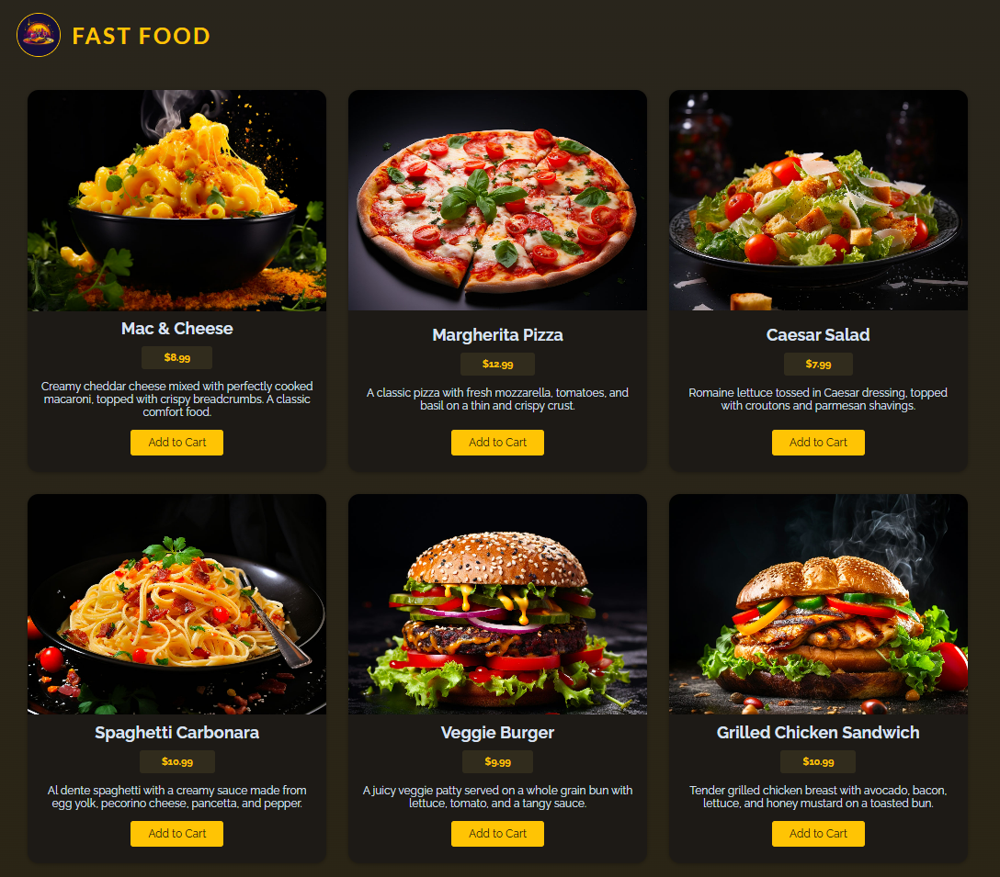

# Fast-Food

A React project focusing on components, props, and JSX for dynamic UI.

### 🌐 Visit the website: [Fast Food Live Demo](https://fast-food-mz.vercel.app/)

## 📸 Preview

## Key Concepts

- **Components:** Reusable, independent UI blocks in React.  
- **JSX:** JavaScript XML, a syntax for writing HTML-like code in JavaScript.  
- **Props:** Data passed from parent to child components, ensuring one-way data flow.  
